# LED Controller
SHA2017 workshop instructions
----------------
Hello! Today you'll build a LED controller that allows you to change the color of your lights over the internet. It runs on a Raspberry Pi and controls LED strips with some electronics that you'll be soldering together.

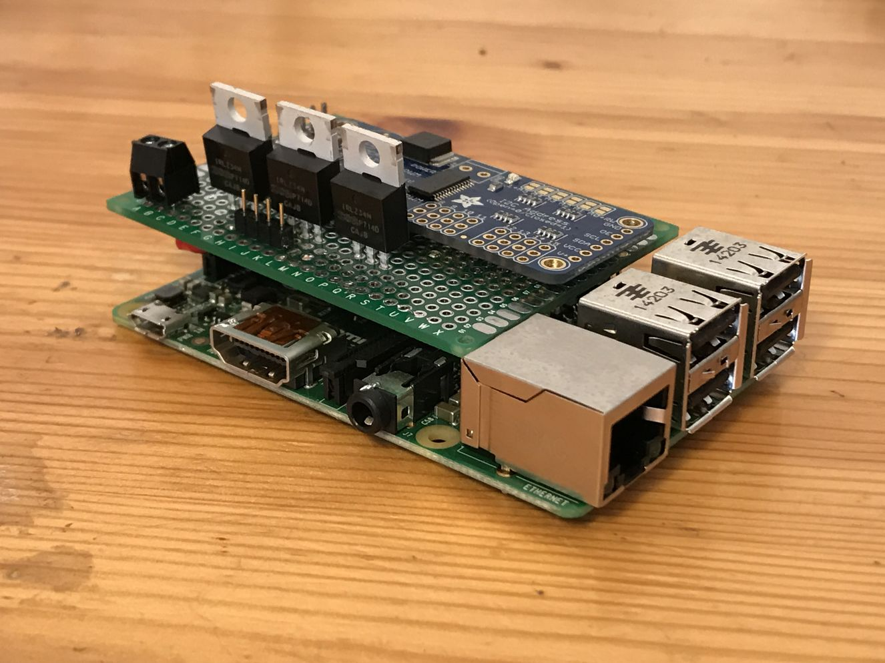
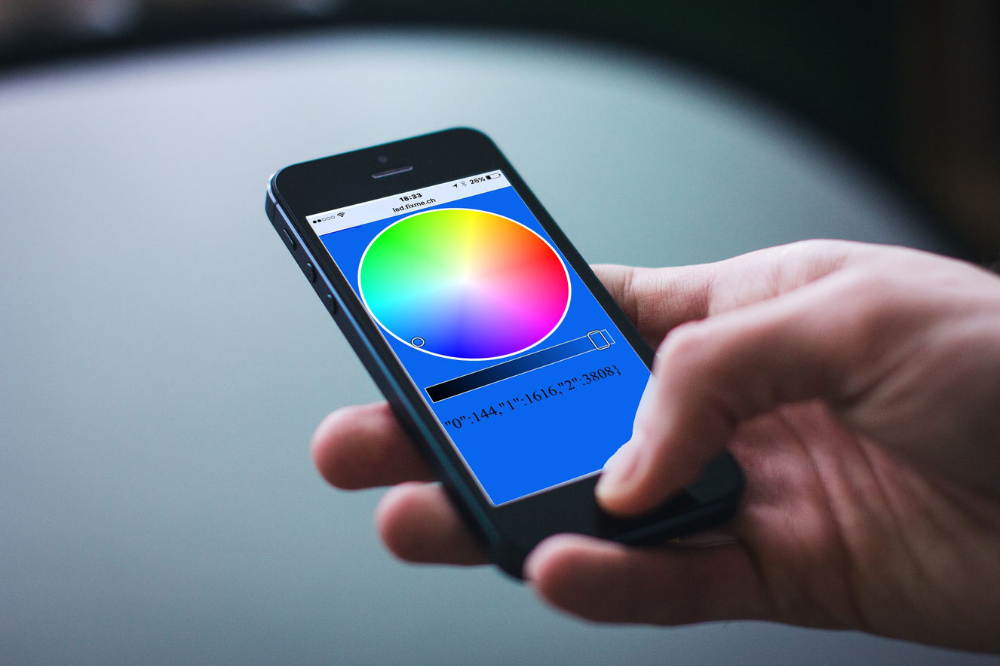

Before you start, make sure you have all the parts:
- LED Strip
- Protoboard (green board)
- PWM Driver (blue board)
- 3 transistors
- 2 pin connector
- 4 pin male male header
- 5 pin male male header
- 5 pin female male header
- DC barrel jack
- Some wire

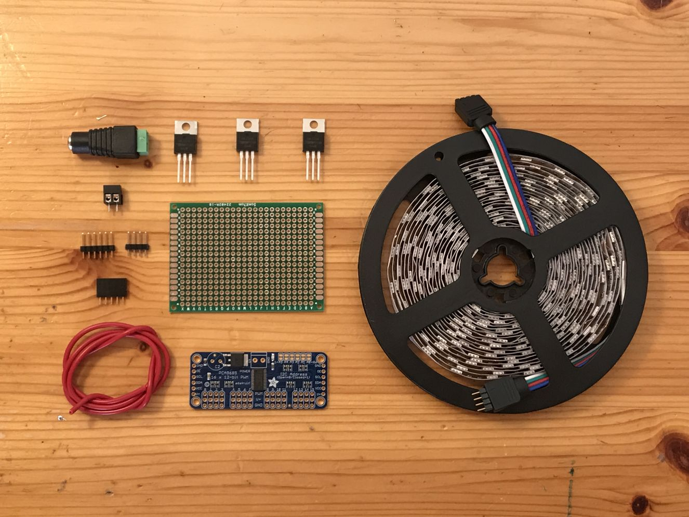

You will also need the following parts which aren't provided with the kit:
- Raspberry Pi
- 12V 2A power supply

Assembly
====

Solder the PWM driver to the protoboard
---------------------
Take the PWM driver, protoboard, 5 and 4 pin male male headers from the kit. Solder the 5 pin header into the left side of the PWM driver, where it says `GND OE SCL SDA VCC V+` (make sure the labels are on the RIGHT of the header). This will connect the PWM driver to the Raspberry Pi over I2C. Next, solder the 4 pin header just under the `0 1 2 3` labels, on the PWM row. These will provide the output PWM signal for the transistors. 

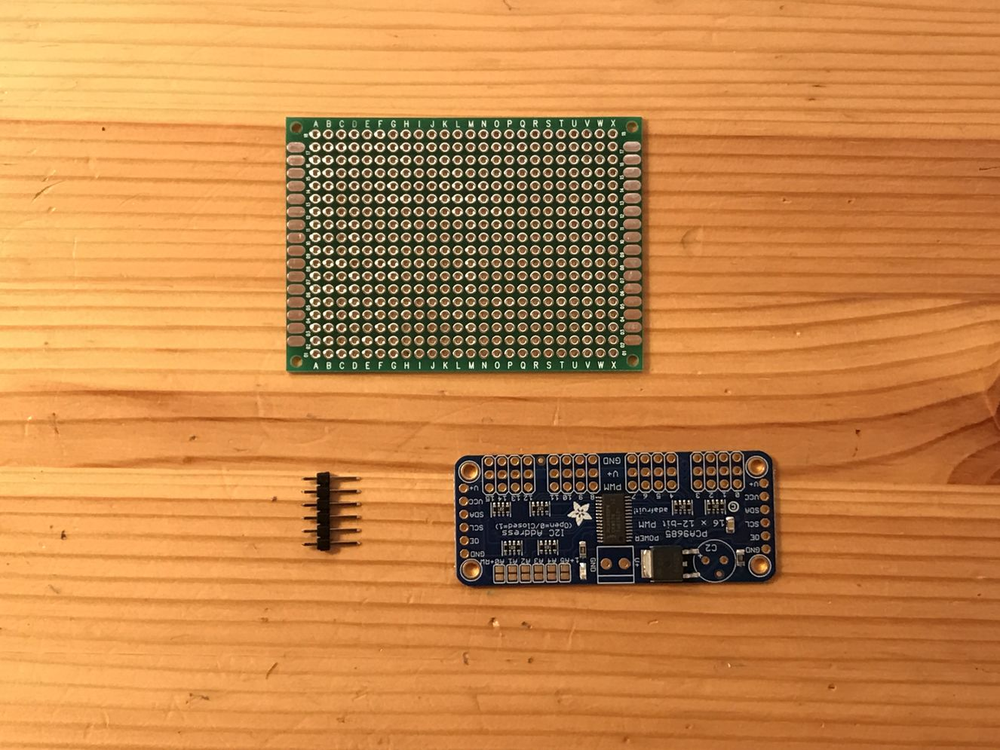

Assemble the PWM driver to the protoboard: place the left topmost pin (GND) onto the protoboard in position C14. The last pin (V+) should be on C08. Solder the PWM driver to the protoboard.

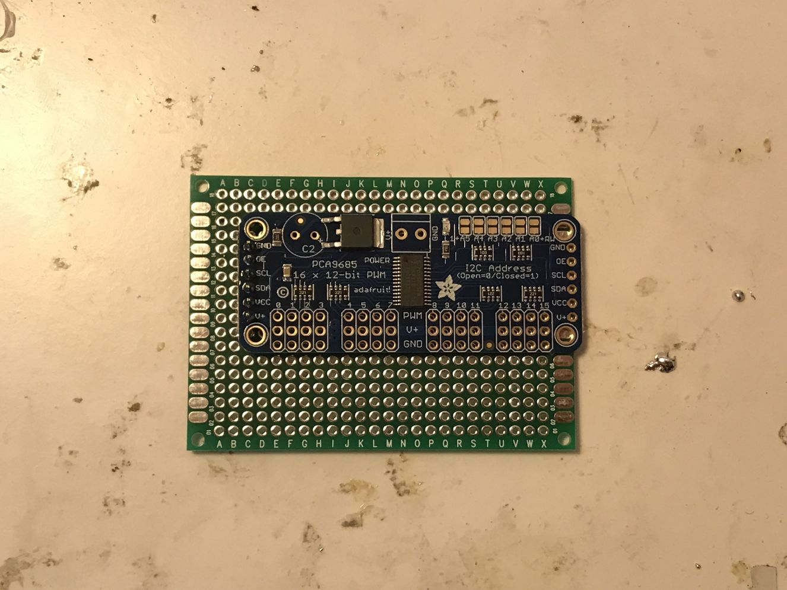


Solder the protoboard to the Pi header
--------------------------------------
Now take your 5 pin male female header and assembled protoboard with the PWM driver. You'll need to solder the header half way into the QRSTU row 17 position. Make sure that it's partially exposed so that you could hook up wires to it on the underside of the PCB.

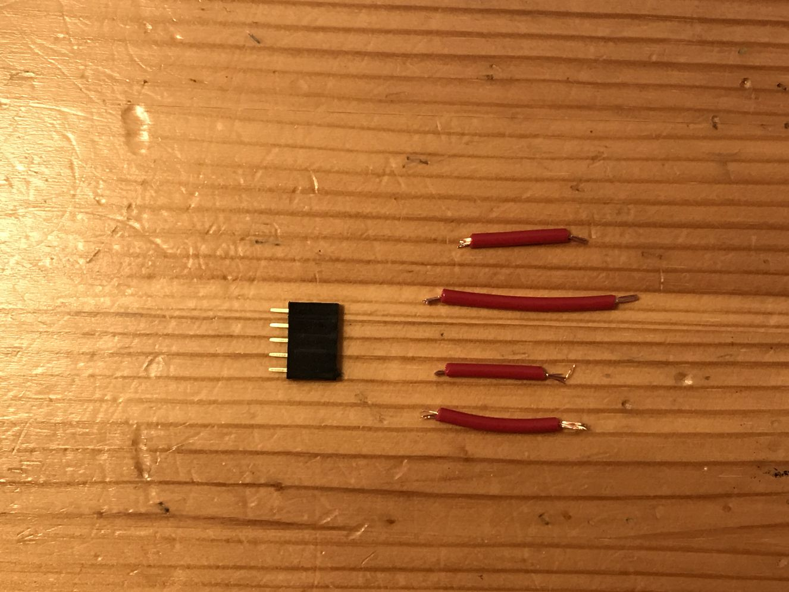

!!!!!!!!!!!!!!!!!!!!!!!!!!!!!!!!!!!! CHECK THIS !!!!!!!!!!!!!!!!!!!!!!!!!

Then you'll need to connect this header to the PWM driver. V+ goes to pin 1, SDA goes to pin 3, SCL goes to pin 5, and GND goes to pin 8.

!!!!!!!!!!!!!!!!!!!!!!!!!!!!!!!!!!!! CHECK THIS !!!!!!!!!!!!!!!!!!!!!!!!!

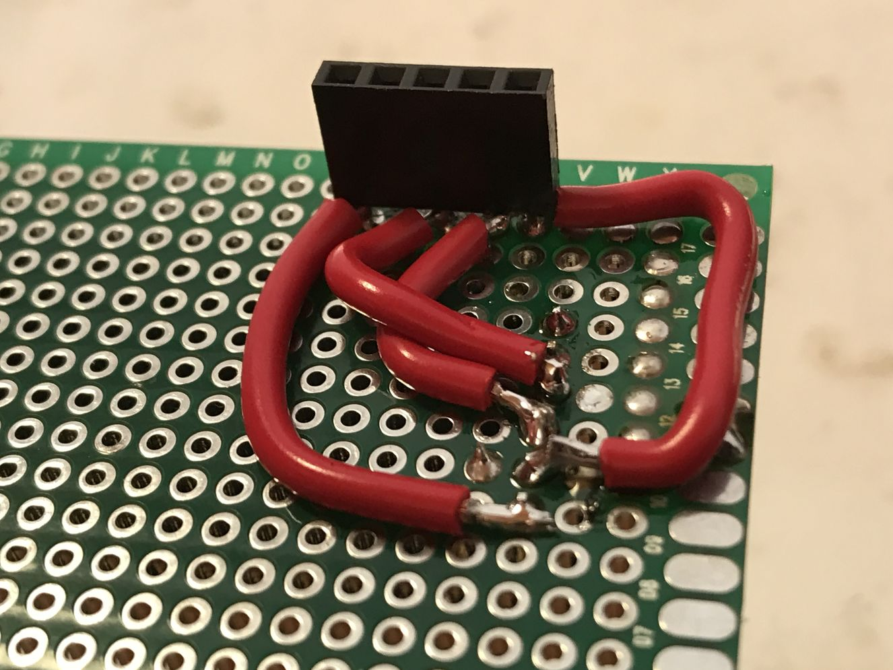


Solder the power connector
--------------------------
Take the 2 pin connector and bend the pins under it a little bit closer together. Place it in the protoboard near the bottom left and solder it in place.

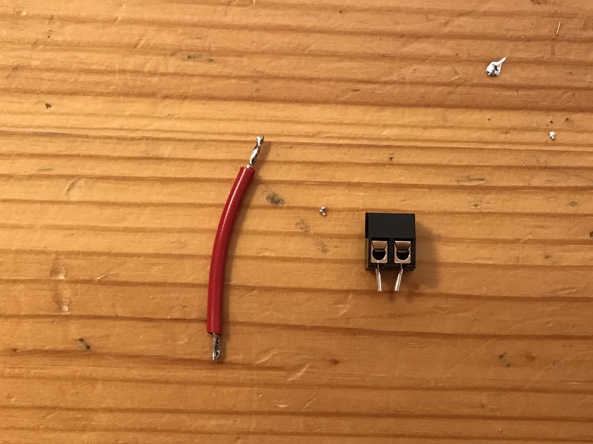

Next, add a ground wire that starts from the 2 pin connector. You'll need to strip a significant chunk of the wire and add solder to it.

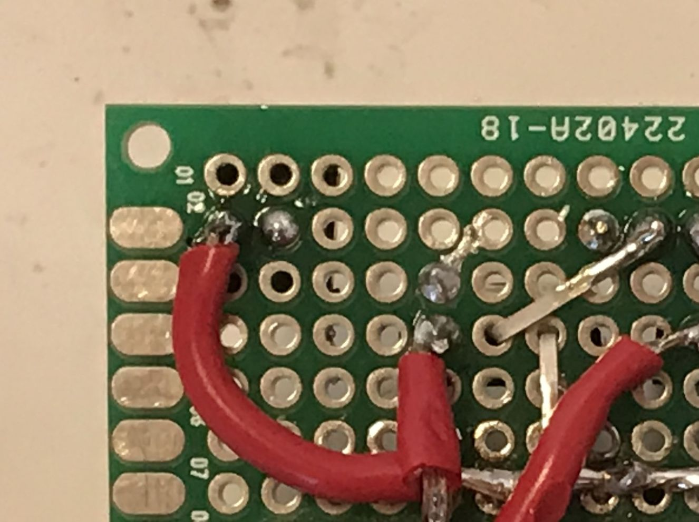


Solder the transistors
----------------------
You'll need to take 3 transistors and some wire. 

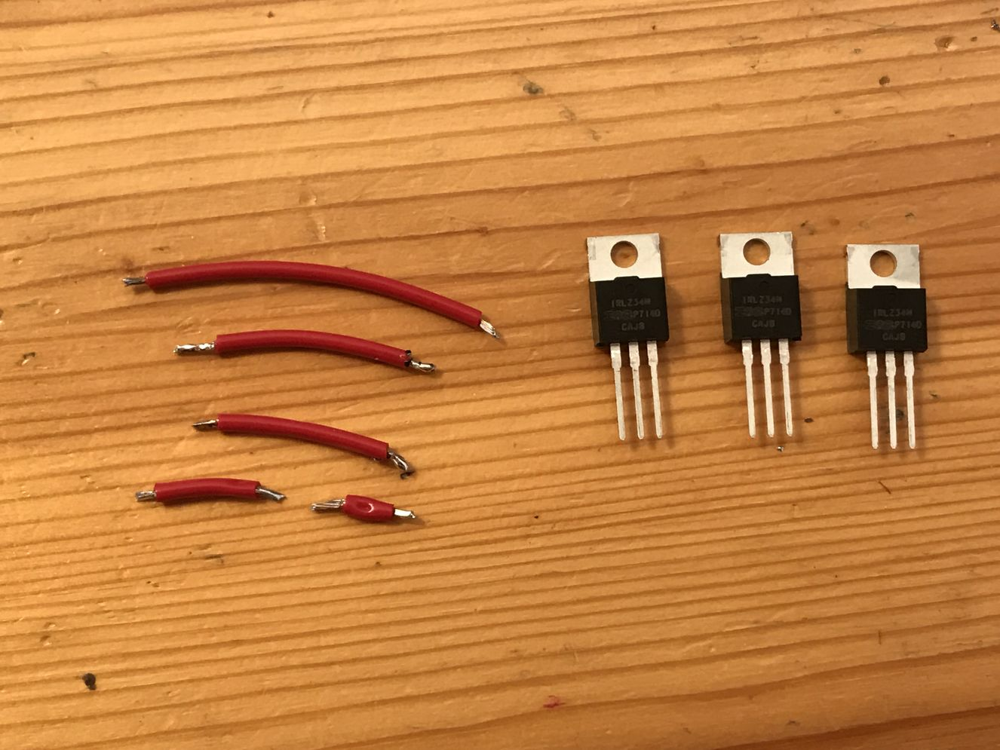

We'll need to get a bit creative with this one. Place the 3 transistors on the protoboard, with the flat metalic surface closest to the pwm driver. The text should be facing you. Now	 bend them as shown in the picture below:

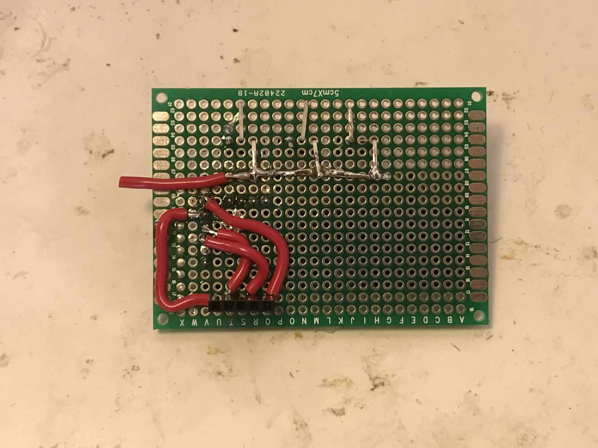

The goal is to reduce how much soldering is required. After bending the transistors, solder them in place, and connect the rigthmost pin to a central ground wire.


Solder the LED connector
------------------------
For this you'll need to remove the male male header from the LED strip. It has a slightly different pitch so normal headers don't work. 

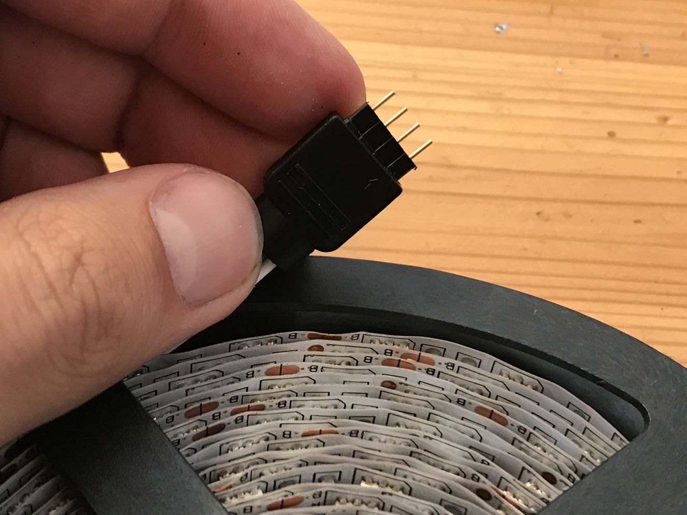

Now place it just under the pins you bent from the transistors, and solder them together. Each middle pin of the transistor should be connected to a pin of this header. The last pin of the header should be connected to the 12v source on the 2 pin connector.


Solder the ground wire
----------------------
You'll need to solder a small wire between the ground of the Pi and the ground of the LED power supply.
[ground bodge]


Solder transistors to PWM driver
-------------------------------
As a final soldering step, you'll need to connect the gate of the transistor to the PWM output pins of the PWM driver. First, cut a few short wires. Then, carefully solder them to each PWM output pin and transistor gate (leftermost pin of transistor).

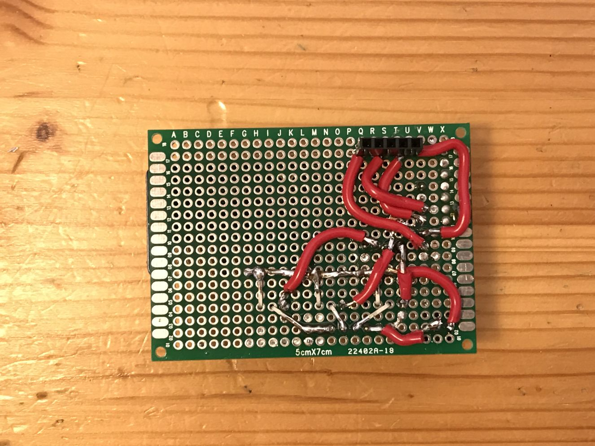


Visual inspection
-----------------
Make sure that there are no shorts on the board. We're working with both 5v and 12v on the same board, so a mistake can be quite costly. Make sure that your board is layed out like this:


[board bottom]

After completing the inspection, cover up the board with duct tape or electrical tape.


Software
====

** Please note that during the workshop, your SD cards will come with all of this prepared. This is for reference. **

Downloading and installing
--------------
Make sure you have a Pi with a recent version of Raspbian (all 2017 versions work out of the box). It has to have `python3.4` or newer, and `python3-smbus` installed.

To check if you have the right version of Python, just type `python3` into the console. You should see the following output:

```bash
$ python3
Python 3.4.2 (default, Oct 19 2014, 13:31:11) 
[GCC 4.9.1] on linux
Type "help", "copyright", "credits" or "license" for more information.
>>> 
```
Push `ctrl + d` to escape.

You will also need I2C to be enabled. To do this, you need to use `raspi-config`:
```bash
sudo raspi-config
> 7 Advanced Options
> A7 I2C
> Yes
```

Finally, clone and install this project onto your Pi:
```bash
git clone https://github.com/sasha42/LED-controller.git
cd LED-controller
pip install -r requirements.txt
````

You should now be able to run the server! Type `sudo python3 server.py`, and you'll see the following output:
```baash
LEDs are initialised
Server is listening
```
**Your LEDS are now controllale over `http://your-pi-ip/` :tada: !** 

Try it from your computer, your phone or any other modern device. You can also connect directly over websockets to `ws://your-pi-pi/ws`.

Making it run on boot
-----------
There are many ways to have something run on boot on a Pi. In this tutorial we will be using `crontab`.	

```bash
sudo crontab -e

# append to crontab
@reboot /usr/bin/python /home/pi/LED-Controller/server.py &
```
Your Pi will now start the LED controller on next reboot automatically.

Exposing it to the internet
---------------
use ngrok


